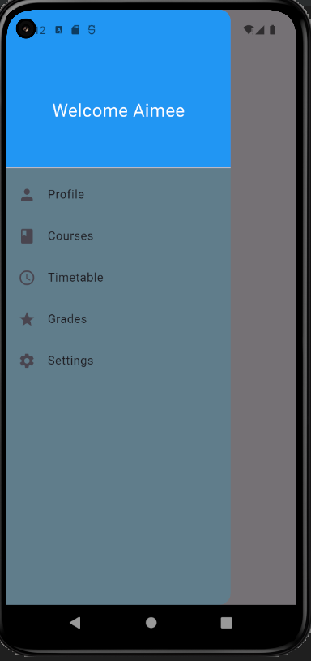

# Flutter Drawer Widget Demo – Student Portal App

A tiny Flutter demo app showcasing the `Drawer` widget through a realistic **student portal use-case**. Tap or swipe from the top-left ☰ icon to open the side navigation drawer.

---

## How to Run

1. Clone the repo:

```bash
git clone <https://github.com/Aimee-Gloire/drawer.git>
```

2. Open the project in **VS Code** or **Android Studio**.
3. Run flutter pub get to fetch dependencies
4. Launch the app the app using 'Flutter run' on an emulator or real device

---

## Widget Properties Demonstrated

1. **backgroundColor** : Sets the drawer’s background color. In this app, it's set to Colors.blueGrey.
2. **elevation** : Controls the shadow behind the drawer. Setting it to 16 gives a noticeable raised appearance when the drawer slides out.
3. **shape** : Customizes the drawer’s border. We used RoundedRectangleBorder with BorderRadius.only() to round only the top-right and bottom-right corners, giving it a smooth and unique feel.
4. **DrawerHeader** :

- Used for displaying a welcoming header at the top of the drawer.
- decoration: Adds a blue background using BoxDecoration(color: Colors.blue).
- child: Contains a Text widget styled with white color and larger font size.

5.**ListTile** :

- Used to display navigable menu items inside the drawer.
- leading: Sets an icon (e.g., Icons.person, Icons.grade, etc.).
- title: Sets the label text (e.g., "Profile", "Grades", "Settings").

6.**ListView** :

- Ensures the contents of the drawer are scrollable if they exceed the screen height.
- **padding: EdgeInsets.zero**: Removes any default padding, letting content sit flush to the top.

---

## Screenshot



---

## Real-World Use Case

This app simulates a university or school student portal, where a student can:

- Tap or swipe to open the drawer menu
- Access key sections like Profile, Grades, and Settings
- Experience a personalized greeting and intuitive navigation
